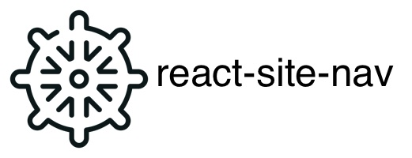

[](https://www.npmjs.com/package/react-site-nav) [](https://www.npmjs.com/package/react-site-nav) [](https://www.npmjs.com/package/react-site-nav) [](https://www.npmjs.com/package/react-site-nav)

> **A beautifully animated nav bar to be proud of. Powered by styled components inspired by stripe.com** :tada:

## Installation

yarn add react-site-nav

## Quickstart

```js
import React from 'react';
import {Switch, Link, Route} from 'react-router-dom';
import SiteNav, {ContentGroup} from 'react-site-nav'; // do this
import Home from './home';
import MyStory from './myStory';

export default () =>
  (
    <div>
      <header>
        {/*
          1. Add SiteNav with ContentGroup as children.
          2. Each ContentGroup will be rendered as a nav item.
          3. You can add anything you want in a ContentGroup.
        */}
        <SiteNav>
          <ContentGroup title="About" width="320" height="200">
            <ul>
              {/* react router link! */}
              <li><Link to="/my-story">My Story</Link></li>
              <li>Another list item</li>
            </ul>
          </ContentGroup>
          <ContentGroup title="Contact" width="350" height="180">
            Free text followed by some links.<br/>
            <a href="mailto:yusinto@gmail.com">Email</a><br/>
            <a href="https://github.com/yusinto">Github</a>
          </ContentGroup>
        </SiteNav>
      </header>
      <main>
        <Switch>
          <Route exact path="/" component={Home}/>
          <Route path="/my-story" component={MyStory}/>
        </Switch>
      </main>
    </div>
  );

```

## Api

